### 什么是 numpy 
- python底层做数学计算的基础库，提供了多为数组相对来说比python自带的列表快得多 功能也多。同时也是pandas,matplotlib等库的底层依赖
- 提供了大量数学函数: mean（均值）、std（标准差）、sqrt（开方）、sin/cos、线性代数、随机数等

### 什么是pandas
- 它是专门处理表格型数据的库，相当于python的excel，用于处理股票数据、销售记录、实现数据等表格
- 核心数据结构: DataFrame（二维表格）、Series（一列数据），能做CSV/Excel、筛选列行、缺失值处理、分组(group by)、合并表、时间序列处理，是数据分析的基本工具

### 什么是matplotlib.pyplot 
- 它是绘图库的一个子模块，专门负责画图，可以设置坐标、坐标轴标签、图例等
  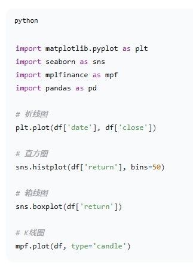
- plt.plot() 拆柱图 import matplotlib.pyplot as plt
- plt.bar() 柱状图
- plt.scatter() 散点图
- plt.hist() 直方图
  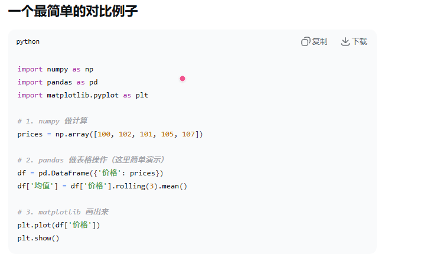

### 布林线完整示意图
- 1.0 布林带宽图：
  - 黑色线：实际价格走势
  - 蓝色线：中轨（20日均线）
  - 红色虚线：上轨（压力线）
  - 绿色虚线：下轨（支撑线）
  - 灰色区域：布林通道范围
  - 绿色：买入信号（价格跌倒下轨）
  - 红色：卖出信号（价格涨到上轨）
  - 红/绿色背景：超买/超卖区域
- 1.1 布林宽带图
  - 紫色区域：带宽变化趋势
  - 橙色区域：低波动（可能变盘）
  - 蓝色区域：高波动（趋势延续）
  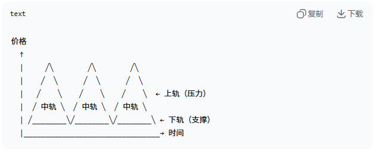
- 1.2 关键视觉特征
  - 价格大部分时间在上下轨之间波动
  - 触及上轨时通常会回落
  - 触及下轨时通常会反弹
  - 通道宽窄代表市场波动大小
- 1.3 三条线的含义
  - 中轨：N周期简单移动平均线，为了判断趋势方向
  - 上轨：中轨 + K倍标准差，压力位/超买
  - 下轨：中轨 — K倍标准查差，支撑位/超卖
  - 经典参数：N=20， K=2（即20日均线，上下2个标准差）
  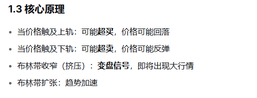

- 2.1 完整公式
  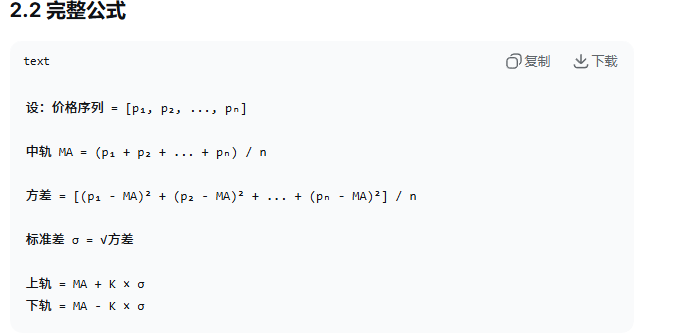
  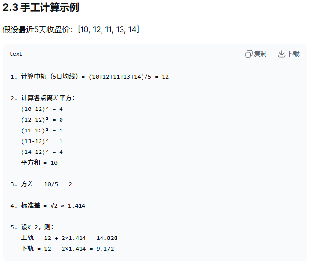
- 2.2 标准差
  - 标准差衡量数据偏离平均值的程度，波动越大，标准差和越大，布林带越宽
  
## 什么是 Pandas DataFrame
- python 数据分析库 Pandas 中最核心、最常用的数据结构。可以将其直观的理解为一个嗲标签的二维表格，它在概念上非常类似于 Excel工作表或者SQL数据库表
- 数据操作：支持添加、删除行列、重命名、排序、数据合并和重塑等
- 数据导出：处理完成的数据可以通过 to_csv() 或者 to_excel()等方法轻松保存回本地文件
- 查看基本信息：使用 df.shape获取行列维度，df.head()预览前几行，df.info()查看数据类型和缺失值情况，df.describe()获取描述性统计摘要

### 核心结构与组成元素
- 它是一个二维的、大小可变的、支持异构数据（即不同列可以有不同的数据类型）的表格结构。它由三个核心组件构成：
  - 行索引（index）每一行的标签用于唯一标识一行数据，默认是从0开始的整数，但也可以自定义为字符串、日期等
  - 列索引（Columns）每一列的标签即列名用于唯一标识一列，每一列代表一个变量或者特征
  - 数据值（Values）表格中实际存储的数据，其底层通常是一个二维的Numpy数组

### 创建 DataFrame的常见方式
- 核心函数 pd.DataFrame() 
- 从字典创建，字典的key值自动化成列名，对应的值（列表、数组等）成为列数据
  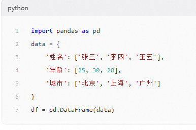
- 从嵌套列表，列表中的每个子列表代表一行数据，需要手动指定列名
  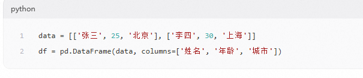
- 从外部文件读取是实际应用中最常用，支持读取CSV、Excel、SQL数据库等多种数据源
  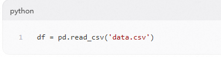
- 在Pandas中，sort_index()方法默认按索引升序排列，若要实现降序排序，只需将ascending参数设置False，其核心逻辑是ascending=True表示”从小到大“，ascending=False表示"从大到小",该参数适用于所有排序场景，包括单机索引、多级索引、按行或者按列排序。
## 关于akshare 
- akshare 是一个封装成统一的python函数
  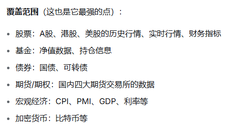
- 数据格式：所有的接口返回的都是 Pandas DataFrame，这意味着我拿到数据之后可以直接用pandas做分析，用 Matplotlib做图表
- pd.to_datetime()是Pandas提供的[日期/时间解析工具]，能把字符串、整数等格式的”日期类数据“统一成标准的datetime64类型，转换后才能高效完成时间序列分析（重采样、滑动窗口、时间对齐等）
  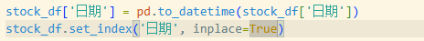
- set_index('日期') Pandas的DataFrame默认索引是数字序号，但在时序分析中，用[日期]作为索引更合理，这样的目的语义更清晰操作更高效
- inplace=True：节省内存不需要额外创建一个新DateFrame，对大数据集友好；代码简洁，后续直接用stock_df就能拿到‘索引已设为日期’的结果，直接修改原DataFrame，不返回新的对象返回值为None
- inplace=False：不修改原DataFrame，而是返回一个新的DataFrame原数据不变
### 命名规则
- 命名模式：{资产类型}_{市场}_{具体数据}_{数据源}
  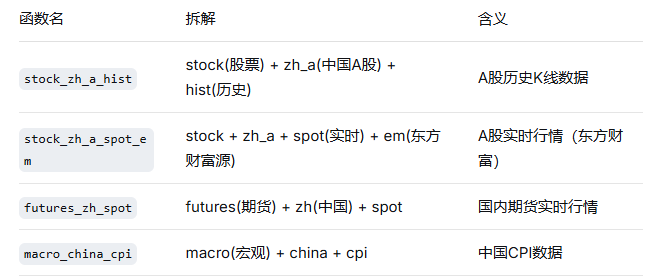
- 历史数据参数含义：
  - symbol: 股票代码
  - period: 周期，"daily"/"weekly"/"monthly"
  - start_data\end_data: 格式"20260605"
  - asjust: 复权类型，""(不复权) / "qfq"(前复权) / "hfq"(后复权)
- 返回的是一个 DataFrame，可以看到日期、开盘、收盘、最高、最低、成交量等列
  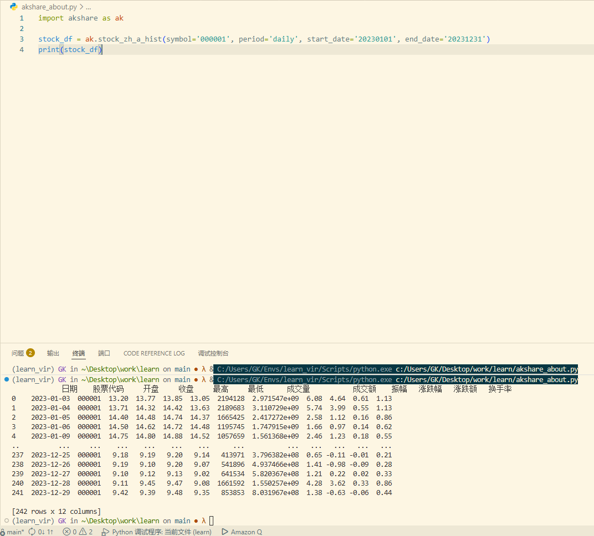

