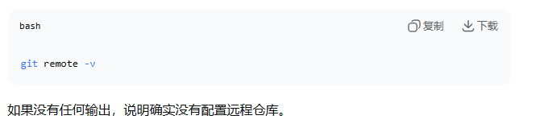
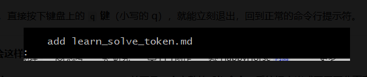
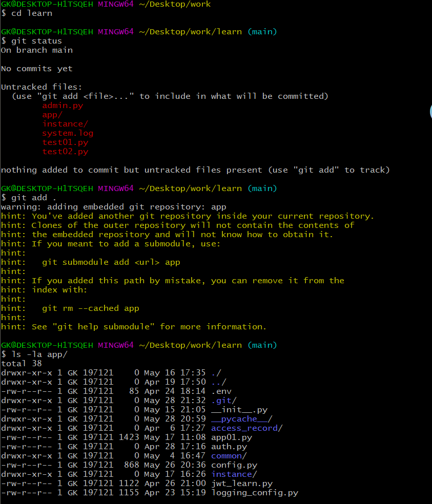
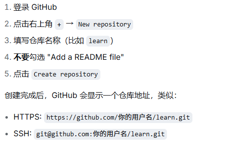
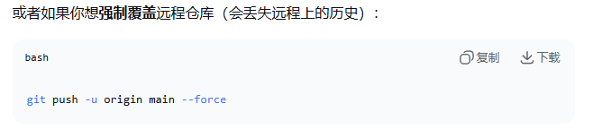
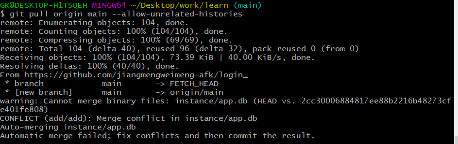
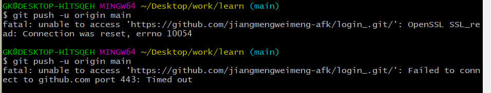
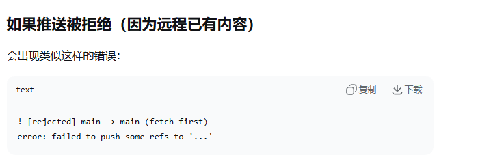
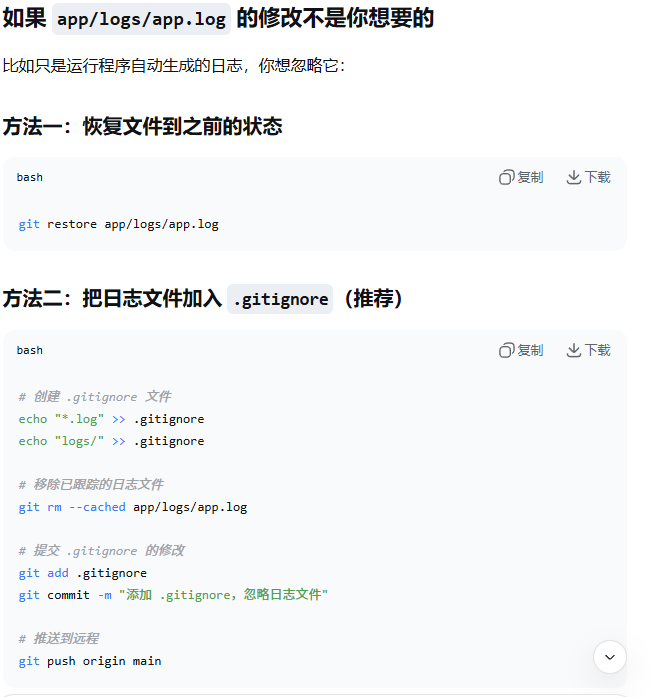
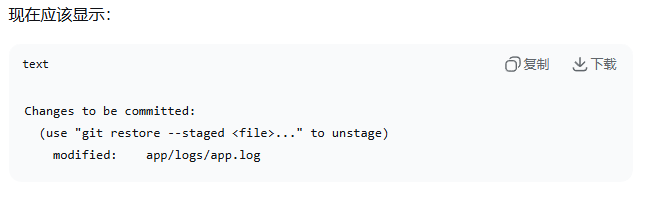

### Git 命令行
- 关于Git命令行的推送 更行... 老忘记怎么办 记得少 练得少
- git add . 添加所有的修改和新增的文件 包括为最终的文件
- git commit -m 提交并且修改信息
- git remote -v 检查是否关联成功远程仓库是否成功配置
  
- git remote add origin htttp://gitbug.com/jiangmengweimeng-afk/目标文件.git  添加到远程仓库
- git push -u origin main 把本地 mian 分支推送到远程origin的mian分支
- git pull origin mian  从远程origin的mian分支拉取最新的代码到本地
- git reomote remove origin 用于删除之前已经关联仓库执行的命令
- git config --global --list 查看 git  全局配置
- cat ~/.gitconfig 查看之前有没有保存过远程仓库信息
- git diff --cached/ git deff --staged 查看暂缓区的修改
- cat .git/config 查看git 配置

- cd .. 其中.. 是退出到上一个目录 一个 . 代表一个级别的目录

- ls 查看当前仓库里的文件

- git log 看提交了什么
- git push 把提交推到github

- 如何查看Git命令提交成功呢：
    1.查看最新提交记录：git log -1 显示最后一次提交的信息（提交人、时间、哈希、备注）
    2.简洁版提交日志: git log --oneling （一行显示一条提交，清晰看到所有本地提交记录可以看到刚写的提交备注就是成功的）
    3.直接查看远程仓库提交记录: git log origin/main --oneline（可以看到刚推送的提交就是提交成功）

- 错误信息分别都代表了什么意思：
                            1.fatal: unable to access 'https://github.com/jiangmengweimeng-afk/login_.git/': OpenSSL SSL_read: Connection was reset, errno 10054
                            (这表示是网路层面的错误 git 尝试链接git Hub服务器时候 别强制断开了链接 提交的内容只存在于本地)
                            2.errno 10054 表示是windows系统的的网络错误就是连接被对端重置

- 遇见以上或者类似的问题时候解决办法就是：重新尝试命令git push -u origin main 如果成功就是临时网路问题
- 或者 检测仓库地址和权限：git remote -v 假如地址不对可以重新设置地址：git remote set-url origin xxxxxx

- 我已经在vscode里修改了文件 需要把新的内容也更新到Git仓库 是这样操作的：
    git add .
    git commit -m ""
    git push

### 遇到的情况   

- 遇到如图所示的情况是Git调用的分页器 如何退出呢？
- 在当前界面 直接按下键盘上的小写 q 就可以了 如果不想进入分页器 可以执行 git add xxx.md 这样的命令行格式就可以了
- 如果不小心进入了 vim 编辑器，退出办法是：先 Esc 键，然后 :q (不保存不退出) 或者 :wq (保存并退出)， 再按退出
- 如果遇到的是如图所示的情况 这是因为这个问题是因为我的 app 目录里面已经有一个 Git 仓库了（比如里面有 .git 文件夹）。在外层 learn 目录执行 git add . 时，Git 检测到 app 是一个“内嵌的 Git 仓库”，所以给出了这个警告，我的解决办法可以是：
### 不打算把 app 作为独立的 git 子模块
- git rm --cached app （先取消暂存app, 正常删除暂缓区的app）
- git rm --cached -f app （强制删除）
- rm -rf app/.git （删除 app 内部的 .git 文件夹）
- git add .重新添加所有文件
- ls -la app/ （看看 app 目录下有没有 .git 记住一定是要删除 app/.git 而不是.git  如果是后者需要重新配置仓库 比较麻烦 ）
- git status （是健康的状态就可以继续推送了）

### 如果不小心 .git 这样做：
- 如果我不小心删除了我的主目录，直接重新配置远程仓库就行了
- pwd
- git remote -v 首先先确定没有配置远程仓库
- 如果没有的话，我们要在远程平台创建仓库(GitGub)
- git remote add origin https://github.com/jiangmengweimeng-afk/login_.git
- or git remote add origin git@github.com:jiangmengweimeng/login.git
- git push -u origin main 
  
### 重新克隆远程仓库 把远程仓库重新克隆下来
- cd ~/Desktop/word
- cp -r learn learn_backup （备份当前的代码）
- rm -rf learn （删除当前的learn目录）
- git clone <我的远程仓库地址> learn
<!-- - cp -r learn_backup/* learn/  （把备份的代码中新增的文件复制进去） -->
- cd learn
- git status
- git pull origin main --allow-unrelated-histories
- git add .
- git commit -m "提交"
- git push origin -u main
  

### 解决冲突

- git checkout --ours instance/app.db 强制使用本地的 app.db 覆盖冲突文件
- git add instance/app.db 标记冲突已经解决，然后合并和推送
  
- 如果遇到了 12 所示的问题我们可以多几遍 git push -u origin main 

- 如果有冲突如图所示 我们可以合并远程内容，保留远程历史
- git pull origin main --allow-unrelated-histories
- git add .
- git commit -m "合并远程内容"
- git push -u origin main
 
- git reomte -v 先检查远程仓库配置是否还在，如果显示了远程地址说明一切正常我们就可以继续一下的操作了
- git diff app/logs/app.log  查看具体改了什么
- git add app/logs/app.log 如果修改是我想要的就添加并且提交,然后推送到远程
  
  
- 如果显示的是 9 所示的内容我们就可以继续了
- git diff --cached
- git commit ~ （如果确认提交我们要进行的一步）
- git restore --staged app/logs/app.log （如果不想要这个修改 我们从暂缓区移除）
- git restore app/logs/app.log （恢复工作区的文件） 之后推送

