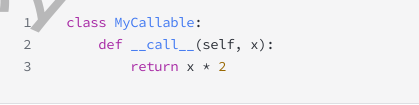
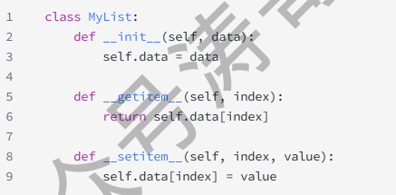
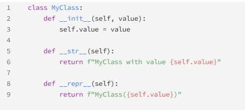
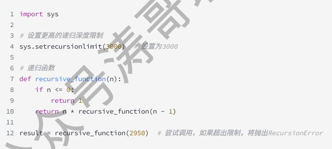

### 1.1 python 的特点：
- 易学易用
- 开放源代码
- 多样性
- 高级内置数据
- 跨平台
- 广泛应用
  
### 解释Python中PE8 是什么？
PE8 是Python增强提案之一，是关于python代码风格指南的提案。它包含了编写python代码时推荐的风格指南和最佳实践。

## super()
### 1.1 核心定义与作用
- **定义：** `super()`是一个内置函数，它返回一个**代理对象**，这个对象将方法调用**委托**给其父类中的一个类
- **主要作用：** 
  - **调用父类方法：** 在子类中方便地调用父类中被重写的方法`__init__`
  - **支持多重继承：** 在复杂的多重继承体系中，确保每个父类的方法被争取且仅调用一次
  - **实现合作式继承**

---

## 2. 基本用法
### 2.1 在之类中调用父类的__init__

- python3.x: `super().__init__(name)`
- python2.x: `super(Dog, self).__init__(name)`
  
**在类方法中(@classmethod)中使用super()**
`super()`同样适用于类方法，类方法中接受的是`cls`而不是`self`

---

## 深拷贝和浅拷贝的区别
### 浅拷贝 `copy()`
- **定义：** 浅拷贝会创建一个**新的容器对象（比如一个新的list或dict），** 但新容器里存放的是原始容器中**各个元素对象的应用，** 它只复制了对象的最外层，没有复制内部的子对象。如果原始对象里的元素是可变对象（dict, list，set），那么浅拷贝对象得到的新对象和原始对象会**共享**这些内部的子对象。修改其中一个的嵌套子对象，另一个也会跟着变。
- **实现方法：**
  - 1. 使用`copy()`模块：`new_obj = copy.copy(obj)`
  - 2. 使用列表的切片：`new_list = old_list[:]`
  - 3. 使用列表的`.copy()`方法：`new_list = old_list.copy()`
  - 4. 使用字典的`.copy()`方法：`new_dict = old_dict.copy()`
  - 5. 使用工厂函数: `list(old_list)`或`dict(old_dict)`
- **代码实例：**
  - 

### 深拷贝 `deepcopy()`
- **定义：** 深拷贝会创建一个**全新的、完全独立的容器对象，** 并且会**递归地**复制原始对象中的所有子对象，新对象和原始对象在内存中是完全独立的。拷贝过程会一直持续到最底层的不可变对象（tuple, bool, str...）新对象和原始对象不共享任何可变对象，修改其中一个任何部分，另一个完全不受影响。
- **实现方法：** 使用`copy()`模块：`new_obj = copy.deepcopy(obj)`
- **代码实例：**
  - 

---

### 关于匿名函数lambda
**特点：** 
- 匿名性
- 表达式形式：
  - `lambda arguments: expression`
  - `lambda`是关键字
  - `arguments`是lambda函数的参数，多个参数用逗号分隔
  - `expression`是lambda函数的主体，它是一个表达式，定义了函数的操作并返回结果

---

### 关于迭代器 `iter()`
- **迭代器**是用于遍历可迭代对象的对象，它在迭代过程中维护了一个位置，并且能够提供下一个值

在python中，可迭代对象时可以被迭代的对象。迭代是指按顺序逐个访问数据集合中的元素的过程。通过迭代，可以访问集合（list, tuple, dict, set）中的每个元素，对每个元素执行相同的操作。

迭代可以通过循环实现，比如`for`循环时python中最常见的迭代机制，它允许用户按顺序遍历数据集合中的每个元素。除此之外，还有一些内置函数，比如`map(),` `filter(),` `zip()`等。

---

### python中的列表推导式
列表推导式时一种简洁的方法，用于创建列表。允许用户根据现有列表、集合或可迭代对象快速生成新的列表，同时提供了更简洁和可读性更强的方式来编写代码

`new_list = [expression for item in iterable if conditin]`
- `expression:` 对每个`item`进行操作的表达方式，用于生成新的列表元素
- `item:` 可迭代对象中的每个元素
- `iterable:` 原始的可迭代对象
- `condition:` 可选的条件，用于筛选生成新的列表的元素

**优点：**
- 简洁性
- 快速
- 可嵌套

---

### 递归函数
递归函数是指在函数定义中调用自身的函数。

---

### python 中的`map()` `filter()` `reduce()`
- `map(function, iterable):` 将一个函数应用于迭代器中的每个元素，返回包含函数结果的迭代器
- `filter(function, iterable):` 对可迭代对象中的元素使用函数进行筛选，返回由返回值为True的元素组成的迭代器
- `reduce(function, iterable):` 对可迭代对象中的元素进行积累运算，返回一个单个的累积结果

--- 

### python中的生成器表达式是什么，与列表推导式有什么区别
区别：
- 1.**内存占用：**
  - **列表推导式**会立即生成所有的元素并存储在内存中，适用于相对较小的列表
  - **生成器表达式**是需要时逐个生产值，不会立即生成所有的元素，节省内存空间，适合处理大型数据
  - `generator = (x for x in rang(10) if x % 2 == 0)`
- 2.**语法：**
  - **列表推导式**使用方括号`[]`
  - **生成器表达式**使用圆括号`()`
  - `list_comp = [x for x in range(10) if x % 2 == 0]`

---

### python中的递归和迭代
- **递归**是一种在函数定义中调用自身的技术，递归式通过系统栈来管理函数调用
- **迭代**是通过循环重复执行一组操作来解决问题，不需要维护额外的系统栈

---

### python中的上下文管理器
上下文管理器是一种对象，它可以定义在`with`语句中执行的初始化和清理操作。
- `__enter__():`当`with`语句快执行时，`__enter__()`方法被调用，并在该方法中执行资源的获取、初始化或设置操作。返回希望分配给`as`关键字的目标对象（如果有的话）
- `__exit__():` 当`with`语句块执行完毕时(无论是否发生异常)，`__exit__()`方法被调用。它执行资源的释放、清理或异常处理等操作。如果有异常抛出，异常信息将作为参数传递给`__exit__()`

---

### 属性
在python中，属性允许通过使用`@property`装饰器来定义类的方法，从而像访问属性一样访问该方法这种方法能够在保持类接口稳定的同时，控制对属性的访问

---

### 魔术方法
`__call__():` 使对象调用

`__getitem() __setitem__():` 获取和设置对象的元素

`__str__() __repr__():` 用于定义对象的字符串表示形式

### 异步编程和同步编程的区别

**同步编程：**

- **阻塞式执行：** 在同步编程中，代码按照预期的顺序依次执行，当遇到I/O操作（文件读写、网络请求）时，程序会阻塞等待I/O操作完成后再继续执行下一代码。一个操作的完成可能会阻塞后续操作，造成程序的执行效率不高。
**异步编程：**
- **非阻塞式执行：** 在异步编程中，当程序遇到I/O操作时，它不会等待I/O操作的完成，而是继续执行其他任务。通过回调、事件循环等机制，在I/O操作完成后会回到相应的任务去处理数据。这种模式下，可以在等待I/O操作的同时执行其他任务，提高了程序的执行效率。

### python中的命名空间和作用域
在python中，**命名空间**时一个存储名称与对象相关联的地方，每个对象都存在于一个命名空间中，允许程序中的名称不与其他位置的名称冲突。命名空间可以看作是名称到对象的映射
**作用域：**
- 局部作用域
- 嵌套作用域
- 全局作用域
- 内建作用域

python会按照LEGB(Local->Enclosion->Global->Built-in)查找变量，变量搜索顺序是：局部->全局->内建。若在局部找不到变量，python会继续向上一级作用域查找，直至全局作用域和内建作用域。

### python中解释器内存管理机制
**垃圾回收：**
- python的垃圾回收使用了引用技术和分代回收两种机制。引用计数追踪对象的引用情况，当引用计数为0时，立即释放对象的内存。分代回收主要处理循环引用等引用计数难以解决的i情况。

### 什么是并发和并行
**并发：**
- 指在单个处理器同时处理多个任务的能力。在并发中，任务可能被快速地切换执行，但实际上并非同时执行。通常通过多任务、线程、协程等实现
**并行：**
- 在多个处理器上同时执行多个任务，在并行中多个任务实际上是同时执行的，每个任务都分配给独立的处理器或核心

### GIL
全局解释锁是python解释器的一个特性，它是为了保证在解释python代码时统一时刻只有一个线程能够执行python字节码。这种设计有助于简化python解释器的实现并提供一致性和易用性，但同时也导致了多线程程序性能上的限制。

### 什么是可迭代对象
- **可迭代对象**是任何可以被迭代（即遍历）的对象，它可以别用于创建一个迭代器

**迭代器**和**可迭代对象**的区别：
- 可迭代对象是能够被迭代的对象，而迭代器是用于执行迭代操作并记录迭代位置的对象。迭代器是一种特殊的可迭代对象，但并非所有可迭代对象都是迭代器。
- 在python中，可迭代对象是指可以提供迭代器的对象，迭代器是一种可以逐个返回元素的对象
- 可迭代对象是指支持使用`iter()`函数生成迭代器的对象，而爹大气是指支持`next()`函数，每次调用会返回下一个值，如果没有下一个值会引发`StopIteration`异常
- 总结来说，可迭代对象是指支持生成迭代器的对象，而迭代器则是用于逐个返回元素的对象。python中的`for`循环可以遍历任何可迭代对象，因为它在内部调用了`iter()`来获取迭代器，然后使用`next()`来遍历可迭代对象的元素。

### 栈帧和堆的区别
- **栈帧：** 是用于存储函数调用及本地变量的地方。每当调用一个函数，一个栈帧就会被创建并推送到调用栈
- **堆：** 是一块用于动态分配内存的区域

### 什么是单例模式
在python中，**单例模式**是一种设计模式，旨在确保类只有一个实例，并提供一个全局访问点。单例模式保证在整个应用程序中，一个类只有一个实例，并提供一个访问点是的应用中的所有其他对象能够访问这个实例

**方法：**
- 装饰器
- 元类

### 元类和装饰器的区别
| 特性 | 元类 | 类装饰器 |
| --- | --- | --- |
| 作用时机 | 类定义结束时 | 类定义结束后（显示调用） |
| 作用范围 | 对该元类的所有类生效 | 仅对被装饰的单个类生效 |
| 可继承性 | 子类会继承父类的元类 | 默认不继承，需要手动装饰之类 |
| 复杂度 | 较高，需要理解底层机制 | 较低，函数式风格更直观 |

### cls 与 self 的区别
| --- | cls | self |
| --- | --- | --- |
| 用于 | `@classmethod`装饰的方法 | 普通实例方法 |
| 指向 | **类本身** | **类的实例（对象）** |
| 访问 | 类属性、类方法、创建实例 | 实例属性、实例方法 |
| 调用方式 | `类名.方法()`或`实例.方法()` | 必须通过`实例.方法()` |      

类方法中不能访问实例属性，`cls`**是类方法中代表类本身的参数，用于操作类级别的数据或创建类实例，并且支持继承多态。**

### python中的装饰器和装饰器函数的区别
**装饰器：**
- 一种用于修改函数或类行为的函数或可调用的对象，它们通过咋函数或类定义之前使用`@decorator_name`的语法来调用。装饰器可以增强、修改或包装被装饰对象的功能。
**装饰器函数：**
- 装饰器函数指的是实现装饰器模式的函数，这些函数可以i接受函数或类作为参数，并返回修改后的函数或类。这些函数 通常会在装饰器语法`(@decorator_name)`中使用，起到装饰器的作用。

### 在python中什么是引用计数
在python中，**引用计数**是一种**内存管理机制，** 它的核心思想：**每个对象都会记录有多少个引用指向自己**当这个计数变为0时候，意味着没有任何变量或容器再使用该对象，python就会立即回收它所占用的内存

- 当引用计数降为0时候，python立即调用该对象的析构函数`(__del__)`方法，并释放其占用的内存

- 引用计数**无法处理循环引用，** 即两个对象互相引用，导致彼此的计数永远不会降为0，造成内存泄漏

### 传值和传址
- **传值调用：** 传递的是值得副本。将一个变量作为参数传递给一个函数时候，函数接收到得是该变量得一个拷贝，而不是原始变量的引用。在函数内部修改参数值不会影响到原始值
- **传址调用：** 传递的是变量的引用。意味着传递给函数的是原始变量的而引用（内存地址），函数内部对参数值的修改会影响到原始值。
- 对于不可变对象：函数内部的修改不会影响到原始对象，在函数内部对于不可变对象作为参数传递，相当于传值
- 对于可变对象：函数内部的修改会影响到原始对象，而对于可变对象作为参数传递时，相当于传址

### 缓存装饰器
python中的缓存装饰器是一种装饰器模式的应用，用于缓存函数的结果，避免重复计算。基于函数的输入参数创建一个缓存，存储函数的输出，如果函数已经使用相同的参数被调用过，会直接返回缓存结果，而不会再次执行函数

- 缓存装饰器可以使用python内置的`functools.lru_cache`来实现。`lru_cache`装饰器允许设置缓存的最大大小，缓存的参数可以是函数的不同参数

### 模块化编程
模块化编程时一种编程方法，旨在通过分解带向复杂的系统或程序独立的、可以单独编程和维护的模块（模块指的是文件中的函数、类、变量等）来提高代码的可读性、可维护性和可重用性

**特点：**
- 模块文件
- 导入
- 封装和抽象
- 重用性
- 可维护性
- 解耦和易读性

### 递归极限
在python中，递归极限是指递归调用的最大层数限制。当递归函数调用超出这个限制时候，python会抛出`RecursionError`递归深度限制时为了防止无线递归导致栈溢出和性能问题
