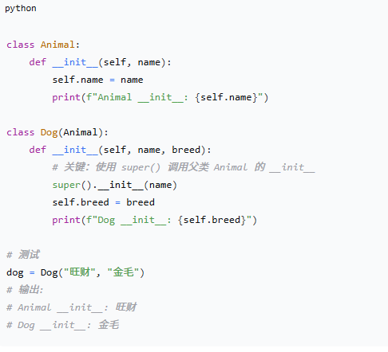
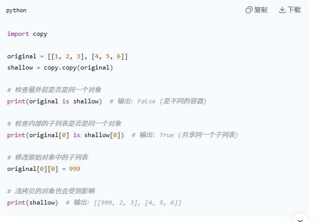
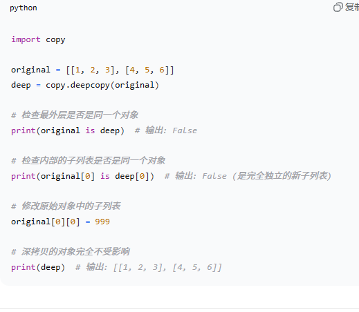

### 1.1 python 的特点：
- 易学易用
- 开放源代码
- 多样性
- 高级内置数据
- 跨平台
- 广泛应用
  
### 解释Python中PE8 是什么？
PE8 是Python增强提案之一，是关于python代码风格指南的提案。它包含了编写python代码时推荐的风格指南和最佳实践。

## super()
### 1.1 核心定义与作用
- **定义：** `super()`是一个内置函数，它返回一个**代理对象**，这个对象将方法调用**委托**给其父类中的一个类
- **主要作用：** 
  - **调用父类方法：** 在子类中方便地调用父类中被重写的方法`__init__`
  - **支持多重继承：** 在复杂的多重继承体系中，确保每个父类的方法被争取且仅调用一次
  - **实现合作式继承**

---

## 2. 基本用法
### 2.1 在之类中调用父类的__init__

- python3.x: `super().__init__(name)`
- python2.x: `super(Dog, self).__init__(name)`
  
**在类方法中(@classmethod)中使用super()**
`super()`同样适用于类方法，类方法中接受的是`cls`而不是`self`

---

## 深拷贝和浅拷贝的区别
### 浅拷贝 `copy()`
- **定义：** 浅拷贝会创建一个**新的容器对象（比如一个新的list或dict），** 但新容器里存放的是原始容器中**各个元素对象的应用，** 它只复制了对象的最外层，没有复制内部的子对象。如果原始对象里的元素是可变对象（dict, list，set），那么浅拷贝对象得到的新对象和原始对象会**共享**这些内部的子对象。修改其中一个的嵌套子对象，另一个也会跟着变。
- **实现方法：**
  - 1. 使用`copy()`模块：`new_obj = copy.copy(obj)`
  - 2. 使用列表的切片：`new_list = old_list[:]`
  - 3. 使用列表的`.copy()`方法：`new_list = old_list.copy()`
  - 4. 使用字典的`.copy()`方法：`new_dict = old_dict.copy()`
  - 5. 使用工厂函数: `list(old_list)`或`dict(old_dict)`
- **代码实例：**
  - 

### 深拷贝 `deepcopy()`
- **定义：** 深拷贝会创建一个**全新的、完全独立的容器对象，** 并且会**递归地**复制原始对象中的所有子对象，新对象和原始对象在内存中是完全独立的。拷贝过程会一直持续到最底层的不可变对象（tuple, bool, str...）新对象和原始对象不共享任何可变对象，修改其中一个任何部分，另一个完全不受影响。
- **实现方法：** 使用`copy()`模块：`new_obj = copy.deepcopy(obj)`
- **代码实例：**
  - 

---

### 关于匿名函数lambda
**特点：** 
- 匿名性
- 表达式形式：
  - `lambda arguments: expression`
  - `lambda`是关键字
  - `arguments`是lambda函数的参数，多个参数用逗号分隔
  - `expression`是lambda函数的主体，它是一个表达式，定义了函数的操作并返回结果

---

### 关于迭代器 `iter()`
在python中，可迭代对象时可以被迭代的对象。迭代是指按顺序逐个访问数据集合中的元素的过程。通过迭代，可以访问集合（list, tuple, dict, set）中的每个元素，对每个元素执行相同的操作。

迭代可以通过循环实现，比如`for`循环时python中最常见的迭代机制，它允许用户按顺序遍历数据集合中的每个元素。除此之外，还有一些内置函数，比如`map(),` `filter(),` `zip()`等。

---

### python中的列表推导式
列表推导式时一种简洁的方法，用于创建列表。允许用户根据现有列表、集合或可迭代对象快速生成新的列表，同时提供了更简洁和可读性更强的方式来编写代码

`new_list = [expression for item in iterable if conditin]`
- `expression:` 对每个`item`进行操作的表达方式，用于生成新的列表元素
- `item:` 可迭代对象中的每个元素
- `iterable:` 原始的可迭代对象
- `condition:` 可选的条件，用于筛选生成新的列表的元素

**优点：**
- 简洁性
- 快速
- 可嵌套

---

### 递归函数
递归函数是指在函数定义中调用自身的函数。

---

### python 中的`map()` `filter()` `reduce()`
- `map(function, iterable):` 将一个函数应用于迭代器中的每个元素，返回包含函数结果的迭代器
- `filter(function, iterable):` 对可迭代对象中的元素使用函数进行筛选，返回由返回值为True的元素组成的迭代器
- `reduce(function, iterable):` 对可迭代对象中的元素进行积累运算，返回一个单个的累积结果

--- 

### python中的生成器表达式是什么，与列表推导式有什么区别
区别：
- 1.**内存占用：**
  - **列表推导式**会立即生成所有的元素并存储在内存中，适用于相对较小的列表
  - **生成器表达式**是需要时逐个生产值，不会立即生成所有的元素，节省内存空间，适合处理大型数据
  - `generator = (x for x in rang(10) if x % 2 == 0)`
- 2.**语法：**
  - **列表推导式**使用方括号`[]`
  - **生成器表达式**使用圆括号`()`
  - `list_comp = [x for x in range(10) if x % 2 == 0]`

---

### python中的递归和迭代
- **递归**是一种在函数定义中调用自身的技术，递归式通过系统栈来管理函数调用
- **迭代**是通过循环重复执行一组操作来解决问题，不需要维护额外的系统栈

---

### python中的上下文管理器
上下文管理器是一种对象，它可以定义在`with`语句中执行的初始化和清理操作。
- `__enter__():`当`with`语句快执行时，`__enter__()`方法被调用，并在该方法中执行资源的获取、初始化或设置操作。返回希望分配给`as`关键字的目标对象（如果有的话）
- `__exit__():` 当`with`语句块执行完毕时(无论是否发生异常)，`__exit__()`方法被调用。它执行资源的释放、清理或异常处理等操作。如果有异常抛出，异常信息将作为参数传递给`__exit__()`

---

### 属性
在python中，属性允许通过使用`@property`装饰器来定义类的方法，从而像访问属性一样访问该方法这种方法能够在保持类接口稳定的同时，控制对属性的访问