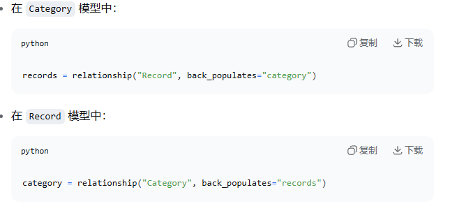
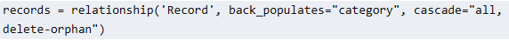

### 一、什么是“时间记录API

在软件开发中，“时间 记录API”通常指**用于获取、处理、格式化、计算时间数据的接口**
- 1.系统获取时间
- 2.时间计算与格式化
- 3.时间记录/日志，在业务流程中记录关键时间点
- 4.定时任务/超时控制,等待多久、超时判断

---

### echo 

`echo=True:` 所有执行的SQL语句、参数、执行时间都会打印到控制台，相当于print。`echo` 控制**SQL ALchemy引擎是否将生成的SQL语句输出到日志（标准输出）。** 
- **开发调试和阶段非常有用**，可以实时查看SQL是否正确、是否有N+ 查询等问题。
- **生产环境：**用`echo=False`,因为会打印大量日志拖慢性能；并且日志中可能包含敏感数据，比如插入的用户信息等。

`echo:`最终底层是设置python的`logging`级别, `echo=True`相当于将SQLAlchemgy引擎的日志级别设置为`logging.INFO,` `echo=False`则为`logging.WARNING`

### session

在python异步代码中，`session`参数通常指代**客户端会话 Client Session，** 就是一个连接池和状态管理器，它的核心意义在于**复用** 和 **控制。**

- **资源服用与性能优化**
- **共享全局配置（Cookie与Headers）：** 传入`session`的意义可以在创建`session`时候设置全局的`headers`(User-Agent、Token)或`cookies。` 当将这个`session`传给后续的多个请求函数时，这些配置会自动带在每一个请求上，无需再每个函数里重复编写认证Header。
- **精细化资源控制**

### expire_on_commit=False/True

- 默认为`True:` 每次`commit()`后，会话中的所有对象属性都会被“过期”， 下次访问时会自动从数据库重新加载。
- `False:` 提交后不回过期对象，保持当前内存中的状态，适合读多写少或者缓存场景。
- 如果写错会报错如图所示的代码：`TypeError: async_sessionmaker() got an unexpected keyword argument 'expird_on_commit'`

### back_populates and relationship

`relationship`不是函数，而是**属性声明**，不应该用`def`定义，直接在类体直接声明：`records = relationship("Record", back_populates="category")`

`back_populates:`建立**双向关系**，让两个模型可以互相访问。这样做的目的是查询类别时候可以获取它下面的所有记录，查询记录时候可以获取它所属的类别。

### ForeignKey

`ForeignKey('categories.id')`,格式是:`ForeignKey('表名.字段名')`

### 关于 time

`server_default` 期望接受一个**数据库函数如（`func.now()`）** 或 **SQL字符串，** 而不是python函数的执行结果
- `server_default=func.now()`数据库函数每次插入时执行，数据库服务器时区

`datetime.now()`是python函数，在这里会被立即执行得到的值是固定的。
- `default=datetime.now()`python会在插入时调用。应用服务器时区

### 什么是Cascade Delete

**级联删除（Cascade Delete）：** 删除父记录时候，自动删除所有子记录，放在**父模型**的`relationship`中。
- 参数`cascade="all, delete-orphan"`可以实现
- `all`包含所有级联操作如`save-update`, `merge`, `refresh-expird`, `expunge`, `delete`
- `delete-orphan`当只记录与父记录接触关联时候，自动删除子记录
  

**为什么要删除级联删除？**
- 如果删除了“编码”这个类别，它下面的所有时间记录应该一起删除，否则这些记录会成为“无主数据”，无法归属到任何类别。

**如果不设置级联删除会怎么样？**
- 删除类别时会报外键约束错误，因为`record`表中还有记录引用这个类别。

### date

`Date:`存储**年月日**，精确到天数。
`DateTime:`存储**年月日时分秒**，精确到秒。

### 约束冲突

`nullable=True` 和 `default=None`在逻辑上矛盾，数据库会先检查`nullable=False`,再应用`default,`但`None`本身就是NULL，会触发约束错误。

### 关于ORM模型层需要思考的全部核心问题

数据库表长什么样？
- **表结构** `__tablename__`定义表名

有什么字段类型？
- **列类型** `Integer,` `String,` `DateTime,` `Date,` `Text`

有什么约束？
- **约束** `nullable,` `unique,` `primary_key,` `ForeignKey`

表和表的关系
- **关联映射** `relationship` + `back_populates`

---

### Field

`Field`的参数必须是**关键字参数** （除了第一个默认值位置参数），不能直接写`min_lenth(..)` 正确的写法是：`Field(..., lenth=1, lenth=64, description='...')`

### 类定义错误

在Pydantic中， 所有数据模型类必须继承自`BaseModel`或者它的子类， 否则Pydantic的验证、序列化功能完全不会生效

---

`from_attributes = True`**的含义（以前是`orm_mode`）：**
- 它的作用是：允许Pydantic从SQLAlchemy模型对象自动提取数据，如果没有这个配置，每次都要手动把模型的字段复制到Schema。

如果想自定义类，不继承父类，但是一定要继承`BaseModel`，因为`BaseModel`是**pydantic的基类**，它提供了所有核心功能：
- 数据验证（类型检查）
- 自动序列化/反序列化
- 字段默认值处理
- 错误提示
如果没有继承`BaseModel`，则定义的类是普通的Python类，没有功能。