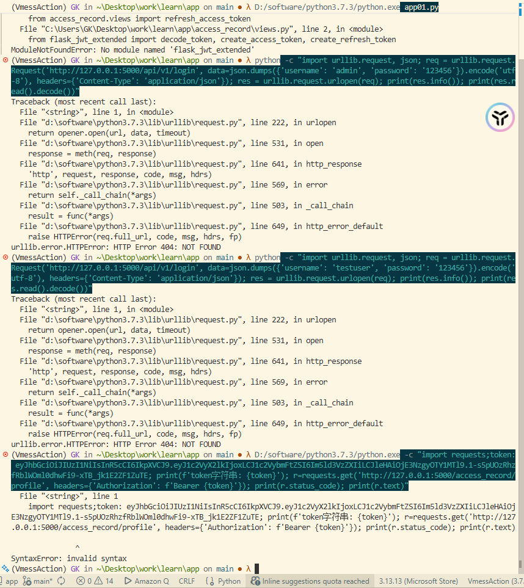
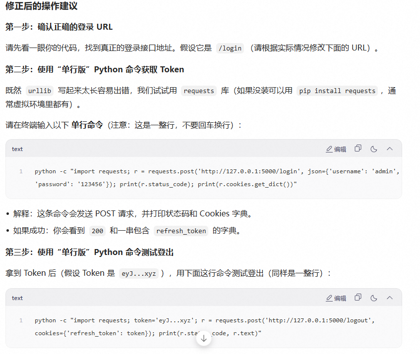
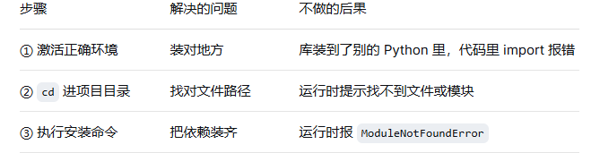
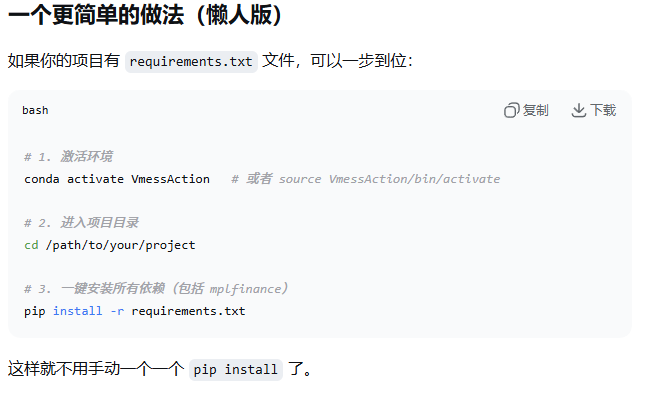
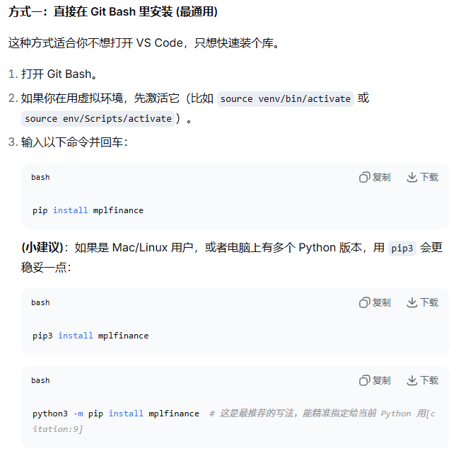
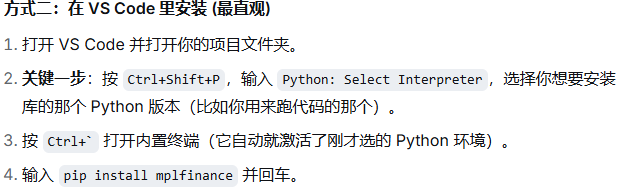
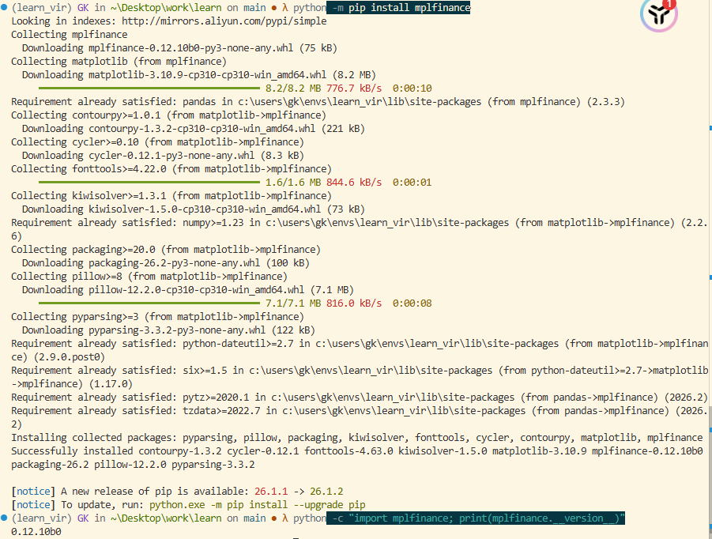
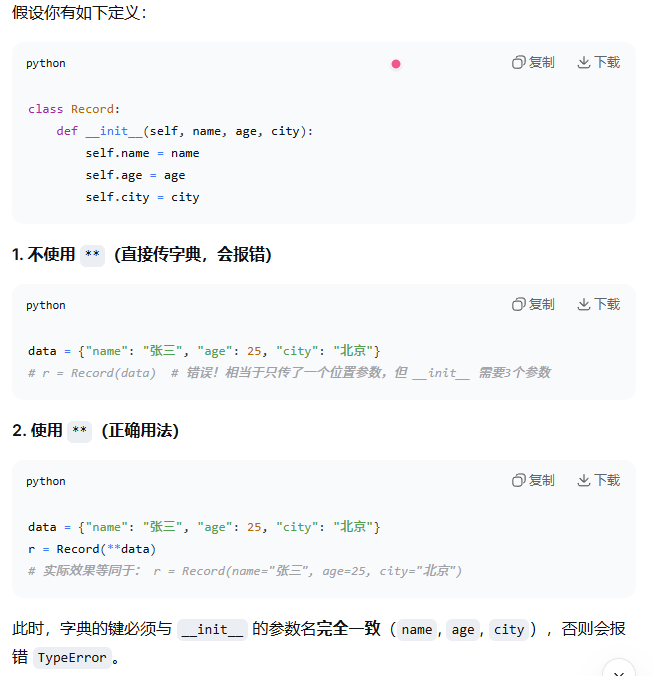

### error
- RefreshToken.query.filter_by(token=cookies_token).first
- 如上所示，如果 first 没有加 () 的话 会发生InvalidRequestError: Object '<function ...>' is not a persistent instance 的报错 
- 原因: 获取到的是这个方法本身的内存地址，而不是查询出来的数据库对象。在python中，first是一个方法

### 遇到python中的测试问题遇到的困难

- 原因分析：你尝试访问 http://127.0.0.1:5000/api/v1/login，但服务器返回了 404。这意味着你的 Flask 后端程序里没有定义这个路径，或者路径写错了。
- 排查步骤：检查定义路由，看的是不是我们app.py 定义的路由
   确认路径：看的是我们定义路由时候的 ('/login')
   查看启动日志: 看有没有打印出所有的路由列表，如果没有显示说明代码里根本没写或者没有加载进来
- SyntaxError: invalid syntax
- 原因：这是你在最后一条命令中遇到的错误。这是因为你在终端里直接粘贴了一大段包含换行符的代码，而 Windows 的命令行（CMD/PowerShell）不支持直接粘贴多行代码块。它把换行符当成了结束符，导致后面的代码变成了无法识别的乱码
- 解决办法：我们需要把多行代码压缩成一行，或者使用分号 ; 连接
  

### 如果遇到当前运行代码的python环境与安装的模块环境不一致
- 1.1 使用 python -m pip 确保安装到当前运行的python环境 如果是python3 可以 python3 -m pip install pandas
- 1.2 验证安装的模块是否真的安装在当前环境中，在当前终端中进入python交互模式 
  - import pandas as pd
  - print(__version__)
- 输出版本号就是安装成功 反之 没有成功
- 1.3 切换 vs code 的解释器
  - 在界面中按快捷键 ctrl + shift + p
  - 输入 Python: Select Interpreter 选择与 vc code 右下角状态栏显示的 version 一样
  - 在弹出的列表中 寻找带有 VmessAction 字样的选项
  - 删除当前的终端 运行时打开一个新的终端 重新运行代码

### 为什么会总是遇到上面的问题呢 
- 我使用 git 命令安装的时候没有将流畅逐步的进行完毕
  - git clone <仓库地址> 下载源码到文件夹
  - cd <文件夹名> 
  - python setup.py install 这一步真正把模块注册到python环境里面 我只进行了下载代码 没有执行安装脚本
## 解决方案
### 重新执行安装命令
- 1. 打开终端，确保我的 vscode 终端已经激活了我之前选好的 VmessAction 环境，这一步时确保终端激活了正确的python环境，装到正确的地方
- 2.进入目录使用cd 命令进图我的git clone 下来的那个文件夹，这是为了运行项目代码 这一步解决的时运行时候可以找到项目文件
- 3.执行安装运行命令 pip install / 老项目 python setup.py install，这一步解决的是把代码变成可以导入的库
  

## pip
- 一定要注意环境一致性，不管是在Windows命令提示符cmd里输入命令还是vscode或者git bash都要注意环境一致性
### 一致性解决办法

- 在vscode里面按 Ctrl + ` 打开终端，不要着急执行命令，看一眼命令提示符，如果是(env) or (.venv)开头说明我是在虚拟环境里面。为了保险起见，直接在我写代码的(.py)文件标签上右键，选择"在终端中运行python文件"。之后把命令修改一下，把python xxx.py 替换成 pip intall mplfinance 再回车键执行，这样就可以保证百分之百装对了地方
  
  
- 关于安装是否成功输入： import mplfinance as mpf print(mpf.__version__)  如果可以打印出版本号，就是安装成功了
- python -m pip install mplfinance 更推荐这个安装方式，python -m pip 可以明确地告诉python解释器，去找属于你的pip 工具来安装。这样的好处是可以避免我的电脑里有多个python版本时候，pip命令装到了错误的环境里面。
  

### 关于akshare 的标准回答
- 1.1 为什么画折线图前要确保日期索引是排序的
  - 因为折线图会按照数据在数据集中的实际出现按顺序依次连接各点。如果日期索引没有排序，即使 x 轴标签看起来是时间顺序，折线也会根据原始行序连接，导致时间顺序错乱、折线来回交叉，从而完全地反映趋势。排序后，折线才能正确暂时时间序列的变化方向。不排序画出的不是时间趋势，而是数据存储顺序的趋势
- 1.2 直方图的bins参数改大的话会怎样？
  - 每个区间宽度变小会导致直方图柱子更细，能更惊喜地展现数据的局部分布细节。但更大可能会导致噪声突出、出现虚假的稀疏或者波动，失去整体分布形状的概括性
  
### 关于使用上下文管理器我容易搞混淆的地方
- 如果在命令行使用上下文管理器写 with 语句很难完美地表达 “换行 + 缩进”, 就会报 Syntax Error 的错误，使用 push():手动把应用上下文“推”进去（相当于进入 with 模块）；pop()：手动把应用上下文“弹”出来（相当于离开 with 模块）。
- python -c "from app01 import db, app; ctx = app.app_context(); ctx.push(); db.create_all(); ctx.pop(); print('数据库表检查/创建完成！')" 这个命令是绝对可以跑通的

### 关于一些测试问题老出错的方面
- 查看文件是否有重复的，如果有的话及时整理
- 查看导入的路径是否因为文件重复而手动没及时纠正路径
https://chat.deepseek.com/a/chat/s/3774d5e8-a253-45d0-9d43-94b9b5f85fe9

### about api 接口返回格式
- 我的api接口统一使用json格式返回，并且HTTP状态码遵循RESTful规范成功是200， 所有响应都包含统一的code状态码，message提示信息和data业务数据这三个外层字段
### 关于不可变和可变的区别
- 1.1: 不可变对象在创建后，其内部存储的值不允许被更改。任何试图修改该对象的操作都不会在原内存地址上修改数据，而是会创建一个新的对象并且返回新的内存地址。
  - 内存机制：当不可变对象发生”变更”时候，python解释器会在堆内存中开辟新的空间存储新值，并将变量名重新绑定到新地址，原对象若没有其他引用则会被垃圾回收机制回收。
  - 常见类型：int, float, bool, str, tuple, frozenset
- 1.2: 可变对象在创建后，其内部存储的值允许被修改，修改操作会在原内存地址上直接进行数据的增删改，无需创建新对象。
  - 内存机制：对可变对象的修改比如添加元素、更新值，仅改变对象内vu的数据结构，而该对象在堆内存中引用地址ID保持不变。这表明着所有指向该对象的变量都会感知到变化。
  - 常见类型：list, dict, set, 自定义类的实例对象

---

### 对于 async 专业术语说法

在python异步编程里，**“async/await语法的常见使用场景”** 或 **“协程（corouteine）的常见操作”**

**关于异步函数：** 如果异步函数内部有`await`说明这个函数内部可能会有`await`操作（比如异步数据库查询），不会阻塞主线进程，提高并发性能。

---

### the difference between yield and return zhuanye shuyu de jieshi

**`yield:`** 函数保留执行状态，下次调用的时候从上次暂停的地方继续执行。把数据**临时交出去**，但控制权函数的状态还攥在手里。

- **适用状态：** 爬虫、读取超大文件或处理数据流时候用 `yield` 因为它可以像`for` 循环流水线一样处理数据，而不是一次性把数据全部加载到内存里。

**`return:`** 函数终止，销毁局部作用域，调用者拿到返回值，函数彻底结束。

`函数:` **模型类或者ORM模型**
`写代码:` **定义模型**
`数据库配置:` **数据库连接配置**或者**引擎配置**
`会话：` **数据库会话或者session**
`基类：` **声明式基类** `Base`式所有模型类的父类，通过继承它来定义表结构。
`模型:` **数据模型**或者**ORM模型**

### nullable=False

在数据库和ORM对象关系映射，如SQLAlchemy中， `nullable=False` **意味着该字段在数据库层面不允许为`NULL`空值或者未知值。** 当在代码中尝试存入空值`None`时候, 触发的错误是**数据库完整性错误或者数据验证错误。** 
- `nullable=False:` 该字段绝对不能是空`None`

---

### scalar() 和 scalars() 得区别 .one() and .scalar()
在python得上下文中，尤其是**Pydantic**和**FastAPI**生态中，`scalar()`和`scalars()`通常指的是SQLAlchemy中`Result`对象得两个方法。
- `scalar()`返回**单个值**（第一个结果得第一个列）
- `scalars()`返回**一个迭代器，**包含所有结果得**第一列值**
  
- `.one()/one_or_none():`严格要求结果必须**有且只有一行，**否则会报错
- `.scalar():`即使结果有**0行**（返回`None`）或有**多行**（返回第一行），都不会报错

--- 

### **xxxxx

在python中，`**`在函数调用时候扮演**字典解包**的角色。
`new_record = Record(**record_data)`以这行代码为例
**核心含义：**将字典`record_data`的键值对，转换为**关键字参数**传递给`Record`类的`__init__`构造方法。
- `**`和`*`的区别：`*`用于解包**列表/元组**为位置参数，`**`用户解包**字典**为关键字参数。
- **不能有多余的键**
- **键名必须匹配**

**两个容易混淆的星号**

| 符号 | 出现位置 | 含义 |
| --- | --- | --- |
| `**dict` | **函数调用时** | **解包：** dict到关键字参数 |
| `**kwargs` | **函数定义**时候 | **打包：** 多余的关键字参数到字典** |

---

- **路由：** URL路径与处理函数的映射关系
- **端点：** 一个具体的API接口，如`GET/categories`
- **依赖注入：** 将`get_db()`注入到路由函数中，获取数据库会话

---

### APIRouter 和 Blueprint 的区别
| 维度 | FastAPI路由注册 | Flask蓝图 |
| --- | --- | ---|
| **本质** | APIRouter是一个对象，通过`include_router`组合 | 蓝图是一个可插板的模块，通过`register_blueprint`注册 |
| **层级** | 支持多层嵌套（v1>records>具体路由）| 支持一层或有限嵌套 |
| **前缀** | 在注册时通过`prefix`参数指定 | 在注册时通过`url_prefix`参数指定 |
| **依赖注入** | 原生支持，强大且类型安全 | 需要额外插件或手动实现 |
| **OpenAPI** | 自动生成，支持标签分组 | 需要Flask-RESTX等扩展 |
| **异步支持** | 原生异步支持 | 需要额外配置 |

### 分离路由的好处
好处 | 说明
--- | ---
**单一职责** | 每个文件负责一个实体的API接口
**易于维护** | 修改`Category`接口时，只需要改`categories.py`
**避免冲突** | 多人协助时，不会在同一个文件里产生冲突
**代码清晰** | 。。。。
**便于测试** | 。。。。