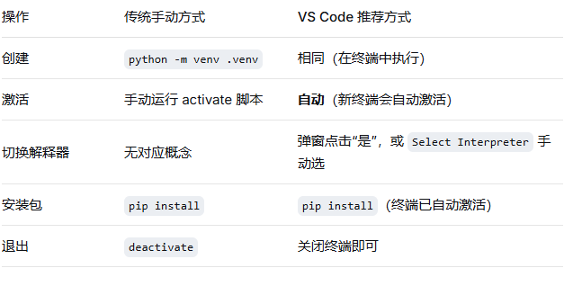

## 如何管理虚拟环境
- 管理虚拟环境分为：创建 > 激活 > 使用 > 退出or 删除
### 1.1 创建虚拟环境
- 打开终端进入我的项目目录 运行 python -m venv .venv  运行后项目根目录虾会多出一个.venv文件夹，里面就是独立的python解释器和包目录
### 1.2 激活虚拟环境
- windows CMD: .venv\Scripts\activate.bat
- windows PowerShell: .venv\Scripts\Activate.ps1
### 1.3 使用虚拟环境 安装包和运行代码
- 安装包：激活后直接用 pip install<包名> 即可，包会自动安装到虚拟环境中，不影响全局
- 运行代码：python app.py 也会使用虚拟环境的解释器
- 导出依赖：pip freeze > requirements.txt 生成当前环境的依赖列表
### 1.4 退出或者删除虚拟环境
- 退出：deactivate 
- 删除: 直接删除 .venv这个文件就行 不会影响系统和项目代码
  