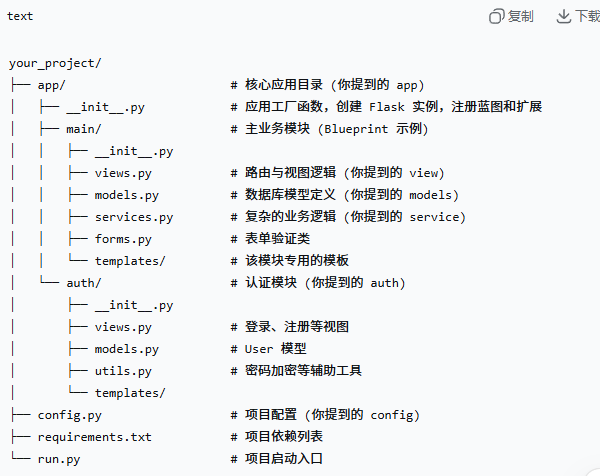
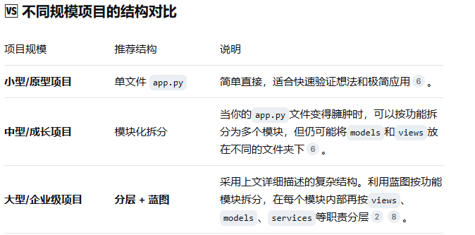

# Flask 完整项目的构建

## 各模块职责详解
  - app/(应用核心)：作为项目的容器，通常包含一个 __init__.py 文件，其中定义了应用工厂函数(create_app)。这是现代Flask开发的标准模式，负责创建Flask实例、加载配置、初始化数据库和登录等扩展、并且注册各个蓝图
  - views.py(视图层/控制器)：这是项目的“交通警察”。它处理来自客户端的HTTP请求，调用必要的服务或者模型，并最终返回HTML模板或JSON数据。这里应避免编写复杂的业务逻辑。
  - models.py(模型层)：定义数据库表结构的python类，通常配合Flask-SQLAlchemy等ORM使用。这里的代码主要负责与数据库的交互（增删改查）。这里要想到[text](sqlalchemy.md)里面的内容
  - services.py(服务层)：存放核心业务逻辑的地方。比如，一个“用户注册”共呢个可能会调用 user_model 创建用户，调用email_service发送欢迎邮件。将逻辑放在这里，可以使用views.py 保持简洁。
  - auth/(认证授权)：这是一个功能模块的典型例子（通常使用蓝图（Blueprint）实现）。它内部包含了认证所需的一切：views.py（登录/登出路由）、models.py（User模型）、forms.py（登录表单）等。
  - config.py(配置层)：集中管理项目的配置变量，如数据库连接字符串、SECRET_KEY、调试模式开关等。通常还会根据环境（开发、测试、生产）定义不同的配置类。
  - run.py(启动入口)：项目的启动文件，代码通常非常简短，主要用于从 app 包导入 create_app 工厂函数，并调用它启动开发服务器。
  
- 视图和业务逻辑分离：views.py 只负责接受请求和返回响应，具体的业务计算和处理交给 services.py 和 models.py 这样做的好处是逻辑清晰，方便单元测试
- 配置与代码分离：记住永远不要把敏感信息（比如数据库密码、SECRET_KEY）硬编码在代码中。应该将它们放在 config.py 或者环境变量里，可以提高应用的安全性。
### 思考和行动
- 我们想写u一个结构完整且健康的最基本的简单框架 我们从如下的结构由简入深的考虑：
- 1. 首先我们要确定构建项目的方向
- 2. 我们要确定项目的结构
- 3. 可以从最基本的app.py 开始 一步一步完善代码的功能
- 4. 知道什么时候添加数据库、表单等 而且要知道添加到哪里：
    - 1: 数据库模型（User, Post），一般都是放在 app/models.py
    - 2: 表单类（LoginForm, PostForm），一般都是在 app/forms.py
    - 3: 处理博客文章的路由，app/views/main.py 或者是新建的 app/views/posts.py 并且注册蓝图
    - 4: config.py （配置变量）
        - app/__init__.py （创建app、初始化扩展、注册蓝图）
        - app/models.py （数据库表结构）
        - app/forms.py （前端表单类）
        - app/views.py（路由和业务逻辑）
        - app/templates/ （HTML页面）
        - app/static/ （CSS\Js\图片）
- 整个Flask后端逻辑（路由、视图函数、数据库模型、表单类、配置、应用工厂）全部由python编写 只有前端暂时部分（HTML\CSS\JS）不是python
### 蓝图是如何注册的呢？
- 1: 首先规划我们的项目目录结构，分出来认证模块，博客模块，主模块
- 2：创建蓝图实例，这时候我们要导入需要的模块和包（from flask import Blueprint, render_template, redirect, url_for）
- 3：之后创建蓝图实例
### 对比
- 在python中制造轮子指的是开发者自己重复实现了一个已经存在的并且成熟的解决方案或者库的功能， 而不是直接使用现成的工具。下面是常见的不同扩展的导入方式对比：
- Flask-JWT-Extended  pip install flask-jwt-extended   from flask_jwt_extended import JWTManager, create_access_token, jwt_required
- Flask-Login  pip install flask-login  from flask_login import LoginManager, login_user, login_required, current_user
- Flask-SQLAlchemy  pip install flask-sqlalchemy  from flask_sqlalchemy import SQLAlchemy
- Flask-WTF  pip install flask-wtf  from flask_wtf import FlaskForm
### raise and return 区别
- 在python中flask的构建中用raise 返回一个结果和return的区别是什么 并且raise是在主动抛出一个错误的时候使用的吗 我这样说正确吗 请你详细且细致的解答我的问题 并且dayload = jwt.decode(
            token,
            current_app.config['SECRET_KEY'],
            algorithms=['HS256'],
            options={
                'verify_exp': True
            }  
- 像如示的代码中 为什么有的=相距是没有间隔的 他们的区别分别是什么呢:
    - 在正常的Flask视图函数中不可以直接i用raise返回一个成功的结果， raise专门用于抛出异常，而return用户返回正常响应。
### raise 和 return 的图表对比
- 特性	return	        raise
- 用途	返回正常响应	抛出异常（错误）
- 执行流程	正常结束视图函数	中断当前流程，进入异常处理
- HTTP 状态码	默认 200，可自定义	通常对应 4xx/5xx
- 能否被捕获	否	可以（通过 @app.errorhandler）
- 后续代码	return 后的代码不执行	raise 后的代码不执行，但可能被 except 或错误处理器接管

- 而我说“raise是在主动抛出一个错误的时候使用的” 这样的说法如同我平时说的一样 是正确的 但是不专业也不精确，可以更好的这样说：
    - raise用户主动触发异常（Exception），不一定是错误 还有异常情况。在python中异常可以分为：内置异常（ValueError、TypeError、KeyError），自定义异常（继承 Exception 类），HTTP异常（Flask中的HTTP Exception）

- 等号位置	是否有空格	示例	原因
- 变量赋值	✅ 两边有空格	name = "张三"	区分赋值与比较
- 关键字参数	❌ 没有空格	func(param=value)	避免视觉混乱
- 函数默认值	❌ 没有空格	def func(x=1):	同上
- 字典键值对	✅ 两边有空格	{"key": value}	提高可读性
- 装饰器参数	❌ 没有空格	@app.route('/')	无歧义
- 类型注解	✅ 两边有空格	name: str = "张三"	PEP 8 建议

- 而这个 = 是否有间隔是遵循PEP8 规范，有这个区别的原因是因为赋值等号（=）是操作符，需要空格来增强可读性。关键只参数等号不是操作符，而是语法标记，去掉空格更紧凑避免与变量赋值混淆。

- return {
            "user_id": payload.get("sub"),
            "username": payload.get("username")
        } 
- 如上所示的代码 为什么"user_id": payload.get('sub') 为什么不是user_id, 而是sub是因为在python的JWT里面Sub代表该JWT所面向的用户