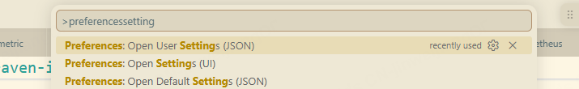

### 记录一些无法归类或没有来得及归类的问题

### 0605
- 现在的环境太乱` 
- 了解下为什么vscode里可以识别到这些环境，终端里怎么使用不同的python解释器的版本 终端里输入python3 是如何找到对应得解释器得
- vscode里如何切换不同的环境
- 如何管理虚拟环境，为什么需要管理虚拟环境
- 为什么要编辑 ~/.bashrc
### 
- 部署一个项目时，我如何选择某个技术栈的版本，你推荐我使用最新的版本吗
- 下载软件时，这些包我应该选择哪个，他们有什么区别
- requirments.txt有什么用
- 为什么python需要虚拟环境
- 为什么我成功执行了pip install -r requirement.txt 后启动项目还是会报错缺少module ldap3
- 什么时markdown语法
- 为什么pip install cffi==1.16.0会提示找不到合适的版本，但将python升级到python 3.10就可以安装
```cs
Gzipped source tarball	Source release		29.7 MB	.sigstore	SPDX	b4c059d5895f030e7df9663894ce3732bfa1b32cd3ab2883980266a45ce3cb3b
XZ compressed source tarball	Source release		22.8 MB	.sigstore	SPDX	d923c51303e38e249136fc1bdf3568d56ecb03214efdef48516176d3d7faaef8
Android embeddable package (aarch64)	Android		20.4 MB	.sigstore		410fff96f47d818136f91f79c8f83202e1364aeaab2022d00fa70e53007ebde1
Android embeddable package (x86_64)	Android		20.8 MB	.sigstore		389bff0b28ddf49651abcc150db21ba617fca3e6ad15cc05544ef1b5b23b9ac1
macOS installer	macOS	for macOS 10.15 and later	72.4 MB	.sigstore		1c5a9b1d0a3f14cf3c38f033232b7ff45efd2eddde5940169f20ef84ec7235b5
Windows installer (64-bit)	Windows	Recommended	28.9 MB	.sigstore	SPDX	b571567bd11ea98fd7a2cf85791d2c8557a63b1e04e9d1dae665a275cac87f1b
Windows installer (32-bit)	Windows		27.5 MB	.sigstore	SPDX	67bef323d951363d06aa73cbbb8a372303c96912b512778ce48fbf9a521cbbfe
Windows installer (ARM64)	Windows	Experimental	28.2 MB	.sigstore	SPDX	c1aee4dfe56ef32a0c5ebf58f6fb1c97dcf037683d659ee16ee5b8641204766a
Windows embeddable package (64-bit)	Windows		11.5 MB	.sigstore	SPDX	cda80a9b1e75c0f1b4f9872ca1b417f0d19bce32facc811aea9180e70fad5fb9
Windows embeddable package (32-bit)	Windows		10.1 MB	.sigstore	SPDX	30e96fbe2a92c24296dd76201dbf793fb877721060e8348b9b647aebf4306850
Windows embeddable package (ARM64)	Windows		10.9 MB	.sigstore	SPDX	55bc0d232f16a8450e6c37c774e4cf397f5212d5e4603e5b92bd1fe85451eead
Windows release manifest	Windows	Install with 'py install 3.14'	15.1 KB	.sigstore		4d203bf22f06c30424650d336b7bc29f94a69d9677ceee231c68ac843ed5ea44

```
- 如何卸载python 
    - 可以直接使用geek卸载

- 环境变量是有什么作用，为什么我在任意的目录下输入一个python 他就能打开python
- 如何多个python版本共存
- window上设置完环境变量后，为什么需要在当前终端里不生效
- 看下这三个配置有什么区别
