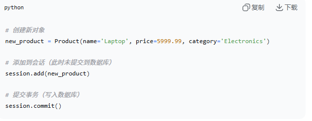
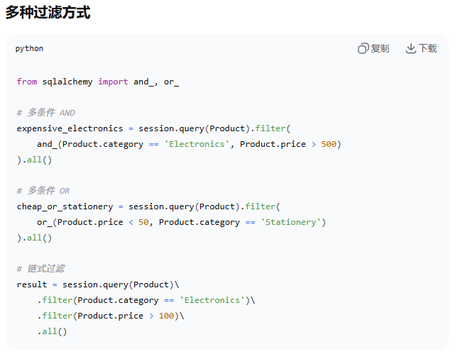
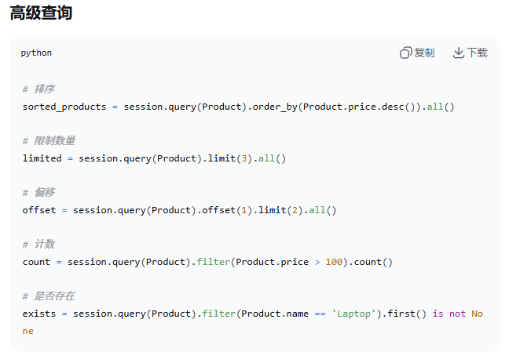
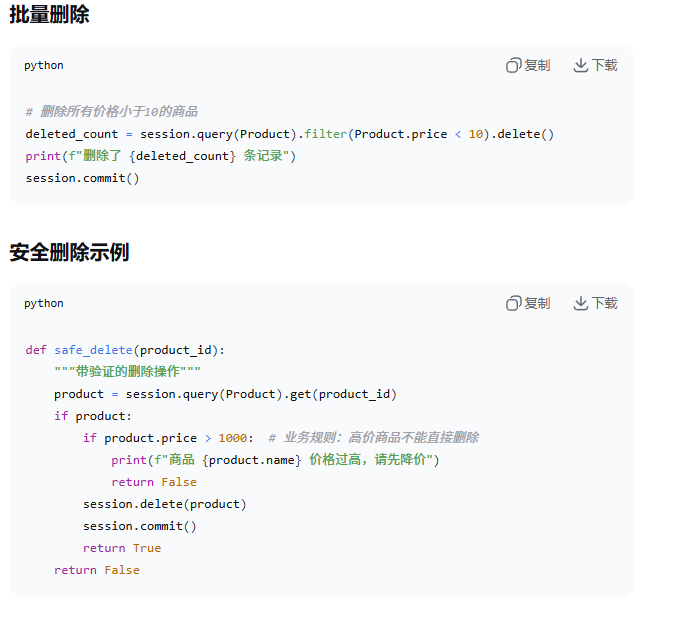

### about 增操作

- 先创建对象
- session.add(pending)
- session.add_all(同上)
- session.commit()

### query/read 操作

- 先查询所有：
        all_products = session.query(Product).all()
- 按条件查询:
        laptops = session.query(Product).first(Product.name == 'Laptop').all()
- 获取第一条:
        product = session.query(Product).get(1)

### update 
- 直接修改对方属性：先查询，然后修改属性，提交更新(product = session.query(Product).filter(Product.name == 'Laptop').first())

### delete

- 删除单个对象时候先查询到想要的对象然后再进行删除：product = session.query(Product).filter(Product.name == 'Alice').first()
- session.delete(product)
- session.commit() 